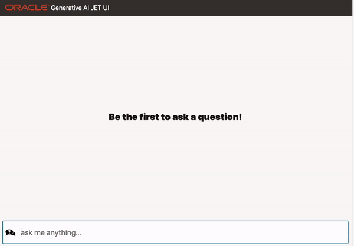
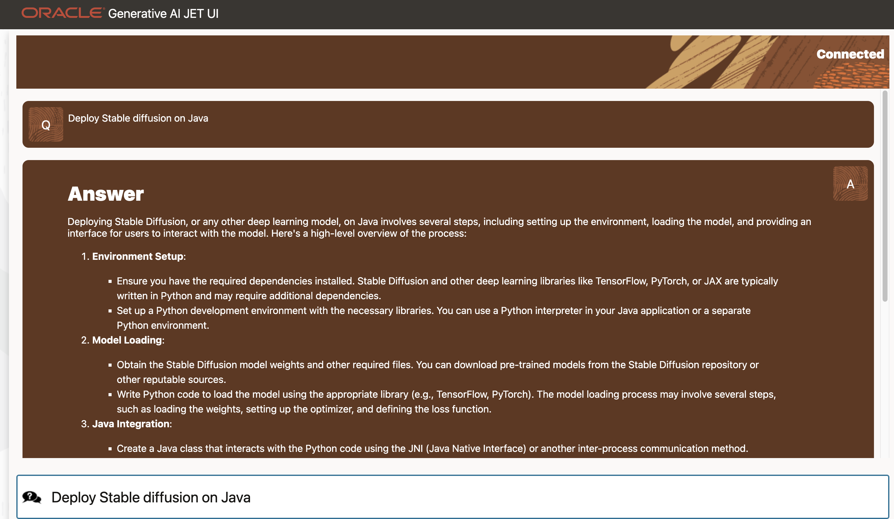

# oci-generative-ai-jet-ui

[](https://img.shields.io/badge/license-UPL-green) [](https://sonarcloud.io/dashboard?id=oracle-devrel_oci-generative-ai-jet-ui)

## Introduction

Using Oracle JET, create a user-friendly prompt-led user interface (UI) to interact with Oracle's new Generative AI service. This toolkit will configure your Generative AI Service connection so you can begin your journey with AI, or migrate your existing (local or Cloud) LLMs to the Oracle AppDev ecosystem.

Oracle JET(Preact) allows you to craft pixel-perfect UIs which are fast, lightweight, and engaging. Your code takes centre stage with Oracle JET, while its powerful features enable you to create dynamic user experiences quickly and reliably.

Oracle's Generative AI service allows developers to unlock a better user experience for chat systems, question-and-answer solutions, and much more. This project provides a front end to that service so you can experiment and get a sense of the immense power of Oracle Generative AI. This is an excellent starting point on your AI journey, and experienced developers will be able to quickly port their LLMs to leverage this powerful service.  

Check out [demo here](https://youtu.be/hpRoQ93YeaQ)



## Getting Started

### 0. Prerequisites and setup

- Oracle Cloud Infrastructure (OCI) Account
- Oracle Cloud Infrastructure (OCI) Generative AI Service - [Getting Started with Generative AI](https://docs.oracle.com/en-us/iaas/Content/generative-ai/getting-started.htm)
- Oracle Cloud Infrastructure Documentation - [Generative AI](https://docs.oracle.com/en-us/iaas/Content/generative-ai/home.htm)
- Oracle Cloud Infrastructure (OCI) Generative AI Service SDK - [Oracle Cloud Infrastructure Python SDK](https://pypi.org/project/oci/)
- Node v16 - [Node homepage](https://nodejs.org/en)
- Oracle JET v15 - [Oracle JET Homepage](https://www.oracle.com/webfolder/technetwork/jet/index.html)

Follow the links below to generate a config file and a key pair in your ~/.oci directory

- [SDK config](https://docs.oracle.com/en-us/iaas/Content/API/Concepts/sdkconfig.htm)
- [API signing key](https://docs.oracle.com/en-us/iaas/Content/API/Concepts/apisigningkey.htm)
- [CLI install](https://docs.oracle.com/en-us/iaas/Content/API/SDKDocs/cliinstall.htm#configfile)

After completion, you should have the following 2 things in your `~/.oci directory`

- A config file(where key file point to private key:key_file=`~/.oci/oci_api_key.pem`)  
- A key pair named `oci_api_key.pem` and `oci_api_key_public.pem`  
- Now make sure you change the reference of the key file in the config file
- Append OCI Generative-AI service compartment and endpoint URL  

```console
vim service/python/server.py
```

```Python
#TODO: Update this section with your tenancy details
compartment_id = "ocid1.compartment.oc1.."
CONFIG_PROFILE = "DEFAULT"
config = oci.config.from_file("~/.oci/config", CONFIG_PROFILE)
endpoint = "https://inference.generativeai.<REGION>.oci.oraclecloud.com"
generative_ai_inference_client = (
    oci.generative_ai_inference.GenerativeAiInferenceClient(
        config=config,
        service_endpoint=endpoint,
        retry_strategy=oci.retry.NoneRetryStrategy(),
        timeout=(10, 240),
    )
)
```

### 1. (Optional) Modify websocket ports  

- In the root of the project directory run to edit ports  
  
```console
vim app/web/components/content/index.tsx
```

```js
const gateway = ws://${window.location.hostname}:1234;
```

- Update default port in Python websocket server:  

```console
vim service/python/server.py
```

```Python
async def start_server():
    await websockets.serve(handle_websocket, "localhost", 1234 )
```

### 2. Upload Public Key

- Upload your oci_api_key_public.pem to console:  
[API signing key](https://docs.oracle.com/en-us/iaas/Content/API/Concepts/apisigningkey.htm#three)

### 3. Install all dependencies

We suggest you install dependencies in a virtual environment to avoid conflicts on your system.  

- Navigate to the server root folder

```console
cd service/python
```

- Create a virtual environment:
  
```console
python3 -m venv venv
```

- Activate your virtual environment:

```console
. venv/bin/activate
```

- Upgrade pip:
  
```console
pip3 install --upgrade pip
```

- Install requirements:
  
```console
pip3 install -r requirements.txt
```

## 4. Start the websocket server app  

Once dependencies are installed and your service credentials are updated you can run server.py  

```console
python3 server.py
```  

## 5. Start JET Client

- Open app directory:

```console
cd ../../app
```

- Install dependencies:  
  
```console
npm install
```

- Run local version:
  
```console
npx ojet serve
```

- Or package for web deployment  

```console
npx ojet build web
```

  You can now ask question to generate LLM based response.
  

  Note that sample app can generate markdown.
  

## Appendix: Token-based Authentication

Check [Token-based Authentication for the CLI](https://docs.oracle.com/en-us/iaas/Content/API/SDKDocs/clitoken.htm#Running_Scripts_on_a_Computer_without_a_Browser)

```Python
config = oci.config.from_file('~/.oci/config', profile_name="DEFAULT")

def make_security_token_signer(oci_config):
    pk = oci.signer.load_private_key_from_file(oci_config.get("key_file"), None)
    with open(oci_config.get("security_token_file")) as f:
        st_string = f.read()
    return oci.auth.signers.SecurityTokenSigner(st_string, pk)

signer = make_security_token_signer(oci_config=config)
# Service endpoint
endpoint = "https://generativeai.aiservice.<Region>.oci.oraclecloud.com"

generative_ai_client = oci.generative_ai.generative_ai_client.GenerativeAiClient(config=config, service_endpoint=endpoint, retry_strategy=oci.retry.NoneRetryStrategy(), signer=signer)
```

## Notes/Issues

Additional Use Cases like summarization and embedding coming soon.

To change output parameters edit server.py

```Python
    cohere_generate_text_request.max_tokens = 500 # choose the number of tokens 1-4000
    cohere_generate_text_request.temperature = 0.75 # adjust temperature 0-1
    cohere_generate_text_request.top_p = 0.7 # adjust top_p 0-1
    cohere_generate_text_request.frequency_penalty = 1.0 # adjust frequency_penalty
```

## URLs

- [Oracle AI](https://www.oracle.com/artificial-intelligence/)
- [AI for Developers](https://developer.oracle.com/technologies/ai.html)

## Contributing

This project is open source.  Please submit your contributions by forking this repository and submitting a pull request!  Oracle appreciates any contributions that are made by the open-source community.

## License

Copyright (c) 2024 Oracle and/or its affiliates.

Licensed under the Universal Permissive License (UPL), Version 1.0.

See [LICENSE](LICENSE) for more details.

ORACLE AND ITS AFFILIATES DO NOT PROVIDE ANY WARRANTY WHATSOEVER, EXPRESS OR IMPLIED, FOR ANY SOFTWARE, MATERIAL OR CONTENT OF ANY KIND CONTAINED OR PRODUCED WITHIN THIS REPOSITORY, AND IN PARTICULAR SPECIFICALLY DISCLAIM ANY AND ALL IMPLIED WARRANTIES OF TITLE, NON-INFRINGEMENT, MERCHANTABILITY, AND FITNESS FOR A PARTICULAR PURPOSE.  FURTHERMORE, ORACLE AND ITS AFFILIATES DO NOT REPRESENT THAT ANY CUSTOMARY SECURITY REVIEW HAS BEEN PERFORMED WITH RESPECT TO ANY SOFTWARE, MATERIAL OR CONTENT CONTAINED OR PRODUCED WITHIN THIS REPOSITORY. IN ADDITION, AND WITHOUT LIMITING THE FOREGOING, THIRD PARTIES MAY HAVE POSTED SOFTWARE, MATERIAL OR CONTENT TO THIS REPOSITORY WITHOUT ANY REVIEW. USE AT YOUR OWN RISK.